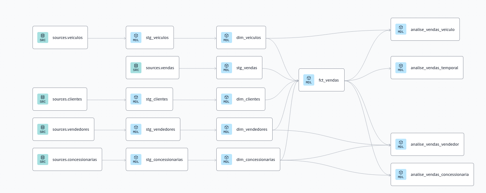

# Visão Geral do Projeto

Este projeto de Data Lake foi desenvolvido como parte do curso "Data Engineering with Airflow, Snowflake, and dbt" na Udemy. O objetivo do projeto era aplicar os conceitos aprendidos durante o curso para construir um pipeline de dados completo e funcional.

## Objetivos do Projeto
- Centralizar dados de diversas fontes em um Data Lake.
- Automatizar a ingestão de dados utilizando Airflow.
- Armazenar e transformar dados no Snowflake.
- Utilizar dbt para criar views otimizadas para análise de dados.

## Estrutura do Projeto
- **Postgres:** Utilizado como banco de dados de origem.
- **Airflow:** Configurado em uma instância EC2 no AWS, utilizando Docker para orquestração de workflows.
- **Snowflake:** Utilizado como Data Lake para armazenamento e análise de dados.
- **dbt:** Ferramenta de transformação de dados e criação de views.

## Configuração e Execução
Os passos para configurar e executar o projeto estão detalhados no arquivo `README.md`.

## Diagrama da Arquitetura

## Conclusão
Este projeto demonstrou a integração de diversas tecnologias para a construção de um pipeline de dados robusto e escalável. Foi uma excelente oportunidade para aplicar os conhecimentos adquiridos no curso e desenvolver habilidades práticas em engenharia de dados.
